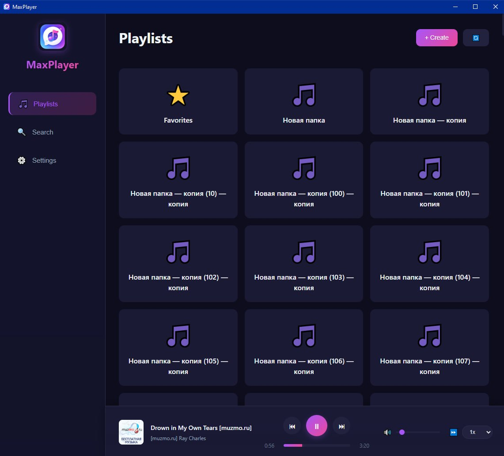
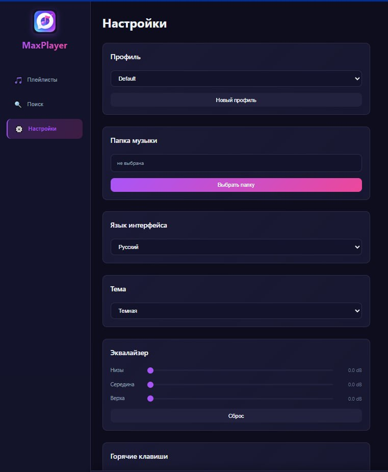
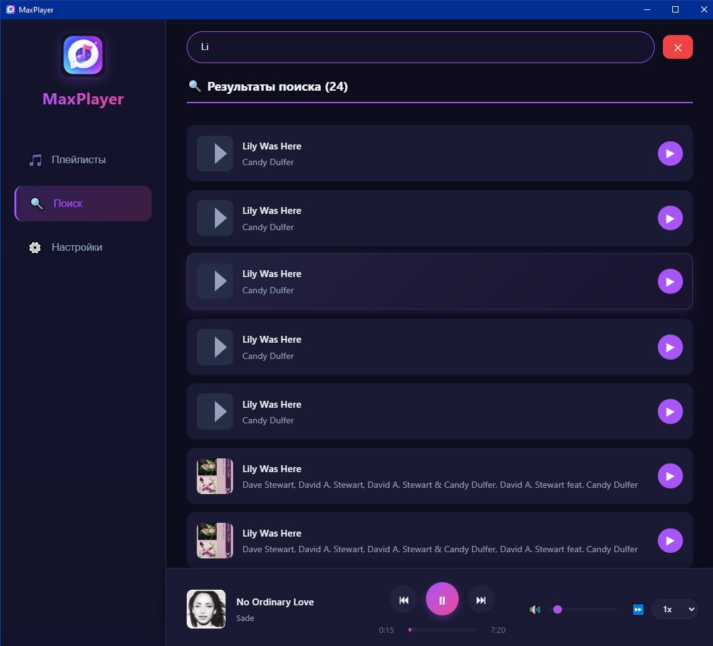

# MaxPlayer

## Что это за приложение

MaxPlayer — это музыкальный плеер для прослушивания локальных аудиофайлов на компьютере. Он позволяет собирать музыку в плейлисты, отмечать любимые треки, переключаться между профилями пользователей и настраивать внешний вид под себя. Приложение работает полностью без интернета.

---

## Основные функции

- Воспроизведение MP3 и WAV файлов
- Управление воспроизведением (плей, пауза, следующий, предыдущий, перемотка)
- Регулировка громкости и скорости воспроизведения
- Создание и удаление плейлистов
- Добавление треков в избранное
- Поиск треков по названию
- Система профилей пользователей (каждый профиль хранит свои плейлисты и избранное)
- Смена темы (светлая / тёмная)
- Эквалайзер с предустановленными профилями
- Случайное воспроизведение (shuffle)
- Выбор папки с музыкой
- Выбор языка интерфейса (русский / английский)
- Горячие клавиши

---

## Инструкция по запуску

1. Скачайте файл `MaxPlayer.exe` из раздела Releases на GitHub
2. Запустите `MaxPlayer.exe` двойным щелчком мыши
3. При первом запуске нажмите на кнопку `Настройки` и выберите папку с вашей музыкой
4. Теперь перейдите во вкладку `Плейлисты`, создайте плейлист и добавьте вашу музыку
5. Наслаждайтесь любимой музыкой в удобном Вам плеере

---

## Какие нужны программы и зависимости

Для работы MaxPlayer ничего дополнительно устанавливать не нужно, программа запускается сама по себе.

**Системные требования:**
- Операционная система: Windows 7 или выше
- Свободное место на диске: не менее 100 МБ
- Оперативная память: от 512 МБ

**Для разработчиков (если нужно собирать проект из исходников):**
- Go версии 1.21 или новее
- Wails CLI
- Node.js

---

## Скриншоты интерфейса

### Плейлисты и избранное

*Создание плейлистов и добавление треков в избранное.*

---

### Настройки

*Выбор папки с музыкой, смена темы, выбор языка, эквалайзер.*

---

### Поиск треков

*Поиск треков по названию — результаты появляются сразу.*

---

## Горячие клавиши

| Действие | Клавиша |
|----------|---------|
| Play / Пауза | Пробел |
| Следующий трек | N или → |
| Предыдущий трек | P или ← |
| Увеличить громкость | ↑ |
| Уменьшить громкость | ↓ |
